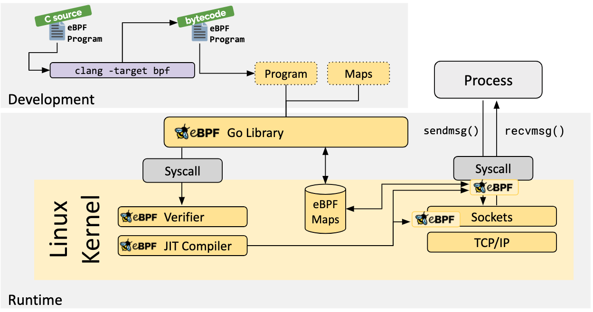
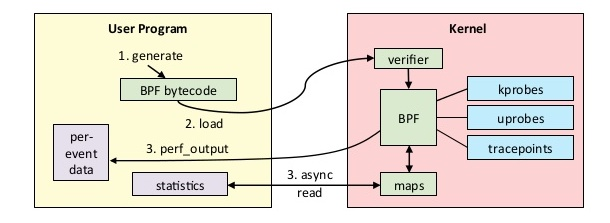

This post describes how to use [gobpf](https://github.com/iovisor/gobpf) and uprobes to build a function arugment tracer for Go applications.

# Introduction

When debugging, we are typically interested in capturing the state of a program. This allows us to examine what the application is doing, and determine where the bug in our code is located. One of the
most simple things we can do is us a debugger to capture function arguments. For Go applications, we will typically use Delve or gdb. While these tools are amazing for debugging in a development environment, they usually do not lend themselves to be used in a production system. Some of the features that make these debuggers powerful also allow them to mutate the state of the application and
cause a significant overhead typically undesirable in a production system. 

We will explore using enhanced BPF ([ebpf](https://ebpf.io)), which is available in Linux 4.x+, and the higher level Go library gobpf to capture function arguments. Using eBPF has its own sets of pros and cons, and will explore that as part of the implementation. 

# What is eBPF?

Enhanced BPF (eBPF) is a kernel technology that is available in Linux 4.x+. You can think about it as a lighweight sandboxed VM that runs inside of the Linux kernel and provides access to various kernel facilities. As shown in the overview below, eBPF allows the Kernel to run verified restricted C code. The C code is first compiled to the BPF bytecode using Clang, then the bytecode is verified to make sure it's safe to execute. Since this verification is strict, and only support a verifiable subset of C, the kernel can then compile the bytecode to verified machine code for efficient runtime execution. This high performance allow eBPF to be used in performance critical workloads like: packet filtering, networking monitoring, etc. Using eBPF we can also insert probes; these are a functions that are executed whenever events occur and can examine the state of the system. Many different types of probes are available, but the one we will focus on for this post is uprobes. 

 ::: div image-l

:::


# Uprobes

One of the features that BPF allows you to access is uprobes; functions that allows you to intercept and provide userspace programs. The flow for a uprobe is essentially the same as any other BPF program, and summarized in the diagram below. The compiled and verified BPF programs is executed as part of a uprobe and the results can be written into a buffer. Let's see how uprobes actually function.

::: div image-l

:::


```go
// computeE computes the approximation of e by running a fixed number of iterations.
func computeE(iterations int64) float64 {
	res := 2.0
	fact := 1.0

	for i := int64(2); i < iterations; i++ {
		fact *= float64(i)
		res += 1 / fact
	}
	return res
}

func main() {
	http.HandleFunc("/e", func(w http.ResponseWriter, r *http.Request) {
        /// Parse iters argument from get request, use default if not available.
        // ... removed for brevity ...
		w.Write([]byte(fmt.Sprintf("e = %0.4f\n", computeE(iters))))
	})
    // Start server...
}
```

```bash
[0] % objdump --syms app|grep computeE
00000000006609a0 g     F .text    000000000000004b              main.computeE
```


```bash
[0] % objdump -d app | less
00000000006609a0 <main.computeE>:
  6609a0:       48 8b 44 24 08          mov    0x8(%rsp),%rax
  6609a5:       b9 02 00 00 00          mov    $0x2,%ecx
  6609aa:       f2 0f 10 05 16 a6 0f    movsd  0xfa616(%rip),%xmm0
  6609b1:       00
  6609b2:       f2 0f 10 0d 36 a6 0f    movsd  0xfa636(%rip),%xmm1
```

```c
#include <uapi/linux/ptrace.h>

BPF_PERF_OUTPUT(trace);

inline int computeECalled(struct pt_regs *ctx) {
  // The input argument is stored in ax.
  long val = ctx->ax;
  trace.perf_submit(ctx, &val, sizeof(val));
  return 0;
}
```

::: div image-xl

:::
sdfsdf


```
(gdb) display /4i 0x6609a0
10: x/4i 0x6609a0
   0x6609a0 <main.computeE>:    mov    0x8(%rsp),%rax
   0x6609a5 <main.computeE+5>:  mov    $0x2,%ecx
   0x6609aa <main.computeE+10>: movsd  0xfa616(%rip),%xmm0
   0x6609b2 <main.computeE+18>: movsd  0xfa636(%rip),%xmm1
```

```
(gdb) display /4i 0x6609a0
7: x/4i 0x6609a0
   0x6609a0 <main.computeE>:    int3   
   0x6609a1 <main.computeE+1>:  mov    0x8(%rsp),%eax
   0x6609a5 <main.computeE+5>:  mov    $0x2,%ecx
   0x6609aa <main.computeE+10>: movsd  0xfa616(%rip),%xmm0
```


::: div image-xl

:::
sdfsdf
